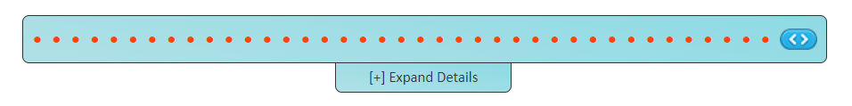
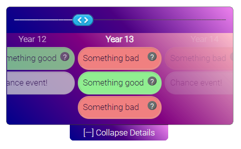

# A lightweight range slider with expandable timeline

See this project at [artoonie.github.io/timeline-range-slider](https://artoonie.github.io/timeline-range-slider)

The project page has dynamic sliders you can interact with.


# A lightweight, dependency-free range slider

The default configuration gives you a slider with a collapsible timeline:


## Features & Benefits
Features:
* A mobile-friendly range slider,
* With a collapsible events timeline to list events which occurred at each index in the slider,
* With tooltips for deeper explanations of the summaries

Benefits:
* Vanilla Javascript & CSS
* No external libraries: no jQuery, bootstrap, Sass, etc
* Simple javascript configuration with sane defaults
* Simple, easy-to-override CSS
* Permissive license

## Examples
### #1: Default


### #2: Dark theme


### #3: Small and continuous


## Usage

### Installation
Pick what works for your setup:
1. `npm i @artoonie/timeline-range-slider`
2. Download assets from [github package](https://github.com/artoonie/timeline-range-slider/packages/592040)
3. Just download the files in the `timeline-range-slider` directory. Go on. I won't judge you.

### Usage
#### API: Vanilla Javascript
If you're not using node.js, functions begin with trs\_ namespace to avoid conflicts:

Include the files in your HTML and create a wrapper div:
```html
<link rel="stylesheet" href="slider.css">
<script type="text/javascript" src="slider.js"></script>
<div id="slide"></div>
```

Create a slider by calling:
```javascript
const config = {wrapperDivId: 'slide', numTicks: 10}
trs_createSliderAndTimeline(config);
```
additional config options are described below.

You can a slider value manually by calling:
```javascript
trs_setSliderValue('slide', 5);
```

You can animate a slider to have it move front-to-back with
```javascript
trs_animate('slide');
```

Hide the timeline with:
```javascript
trs_toggleTimelineVisibility('slide');
```

#### API: Using node.js
HTML:
```html
const slider = require('./timeline-range-slider/slider.js');
require('./timeline-range-slider/slider.css');

<div id="slide"></div>
```

Javascript:
```html
slider.createSliderAndTimeline(config);
slider.setSliderValue('slide', 5);
slider.animate('slide');
slider.toggleTimelineVisibility('slide');
```

### Configuration options
The `config` dictionary has the following options:

| key | default | description |
| --- | --- | --- |
| `wrapperDivId`* | _required_ | The div id in which to place the slider |
| `numTicks`* | _required_ | The number of elements in the slider |
| `width` | `600` | The maximum width of the slider. If the page is narrower than this, the slider will responsively scale. |
| `hideTimelineInitially` | `true` | Whether or not the timeline is initially expanded or collapsed |
| `tickText` | `'•'` | The text that marks a tick in the slider |
| `tickLabelPrefix` | `'Round '` | What does each tick represent? Placed in the header row of the timeline. |
| `color` | `'orangered'` | The color of past tick marks. Can be a single string or a list. If it's a list, must be of size numTicks. |
| `sliderValueChanged` | `null` | Callback to be notified when the slider changes. |
| `animateOnLoad` | false | Should the slider animate all steps on load? |
| `showTimelineWhileAnimating` | true | Should the timeline expand during animation? |
| `timelineData` | random data | The timeline data. See below for how to structure this. |

#### Timeline data structure
The `timelineData` contains the events that occurred at each "tick" in the timeline.
It is a list of lists. Each of the `numTicks` elements contains a list of events.
A single event is structured as follows:
```javascript
const oneTimelineItem = {
  summaryText: "Short summary",
  className: "custom-class-for-summary-label", /* optional */
  moreInfoText: "Description to show when hovering" /* optional */
}
```

Each "tick" can have multiple events (or zero events).

A complete `timelineData` structure might look like:
```javascript
const timelineData = [
    [
        {summaryText: "Event 3, tick 1"},
        {summaryText: "Event 2, tick 1"}
    ],
    [
        {summaryText: "Event 1, tick 2",
         className: "some-class"}
    ],
    [ /* No events in tick 3 */
    ],
    [
        {summaryText: "Event 1, tick 4"},
        {summaryText: "Event 2, tick 4"},
        {summaryText: "Event 3, tick 4",
         moreInfoText: "a long description"}
    ]
]

```
